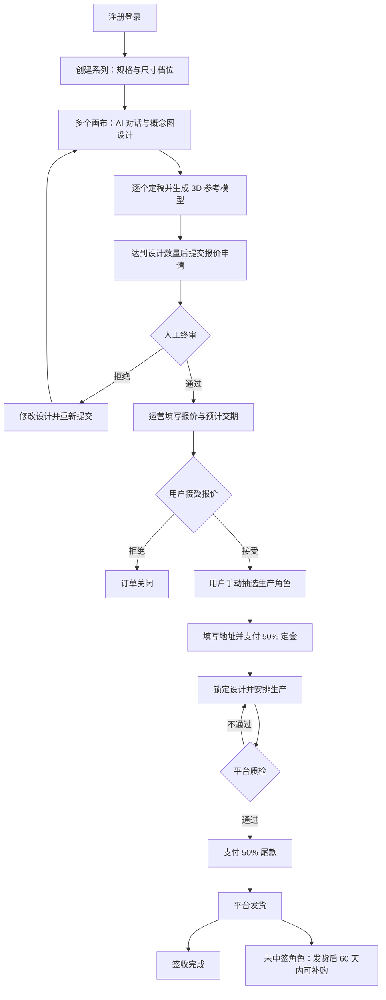
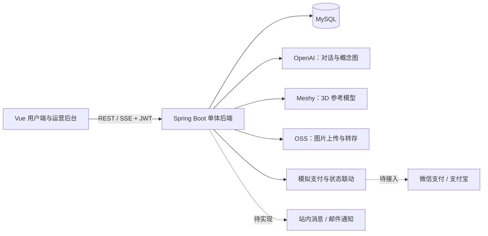

# DIY Figure · AI 定制盲盒手办平台

**从一个原创角色想法，到一套由自己参与设计的实体盲盒。**

DIY Figure 面向原创角色收藏、个性化礼物与定制手办场景，将 AI 对话设计、系列管理、人工终审、报价抽选、分期付款与生产履约组织在同一套系统中。用户表达创意并确认设计，平台运营负责审核、报价、厂家对接、质检与发货。

> **当前状态：开发中 / 内部 Alpha，尚未完成内部 MVP 验收。**
>
> 核心页面和多数业务服务已有初版实现；支付仍为模拟流程，后台权限与交易边界存在缺口，前端生产构建存在已知错误。当前版本不适合直接开放真实付费业务。
>
> 状态核对日期：**2026-09-13**。业务代码基线：`449e18c`。本文区分“已有代码”“部分或模拟实现”“尚未开发”和“尚未验证”，不把接口存在视为产品验收通过。

[产品与流程](#产品与流程) · [功能完成情况](#功能完成情况) · [当前阶段与验证](#当前阶段与验证) · [已知问题](#已知问题) · [架构与目录](#架构与目录) · [本地开发](#本地开发) · [后续路线图](#后续路线图) · [参与贡献](#参与贡献)

## 产品与流程

### 为什么做

让用户参与整套原创角色的设计，并将设计与实体交付连接起来。项目的价值目标包括：

- **创作参与感**：通过文字与参考图片逐步完善自己的角色形象。
- **系列化收藏体验**：将多个角色组织成一个系列，通过抽选决定实际生产的角色组合。
- **可追踪的定制流程**：连接终审、报价、付款、生产、质检、发货与补购。
- **人工交付把关**：保留人工终审和质检，AI 生成的 3D 结果作为厂家精修参考。

项目按小规模、人工运营的定制业务设计。原规划中的月订单量属于容量假设，不代表已有实际订单或营业成绩。商业可行性仍需通过样品、成本核算和真实用户交付验证。

### 用户与职责

| 角色 | 职责 |
| --- | --- |
| 普通用户 | 创建系列、与 AI 协作设计、定稿、接受报价、抽选、填写地址、付款、签收和补购 |
| 平台运营 | 人工终审、报价与交期、厂家对接、开工登记、质检、发货和取消处理 |
| 合作厂家 | 在线下或站外接收生产材料并制造；V1 没有厂家账号或供应商门户 |

### 目标业务闭环

下图描述产品目标流程，各环节的实际完成情况见后文。



“终审拒绝后重新提交”属于目标流程：当前枚举定义了回退转移，但未发现完整的原订单重提接口与页面操作闭环。

### 规格与业务规则

| 档位 | 枚举 | 设计角色数 | 实际定制数 | 未中签角色数 |
| --- | --- | ---: | ---: | ---: |
| 轻量系列 | `LIGHT` | 6 | 4 | 2 |
| 经典系列 | `CLASSIC` | 9 | 6 | 3 |
| 收藏系列 | `COLLECTION` | 12 | 8 | 4 |

- **原创设计约束**：项目规则禁止复刻可辨识的明星、公众人物或已有版权 IP 角色。现有实现包括 AI 提示词约束和人工审核入口，审核准确率尚未验证。
- **手动抽选**：接受报价后由用户触发，从设计集合随机选出生产角色；状态检查限制重复抽选，并发正确性尚未验证。
- **付款节点**：定金与尾款各占报价的 50%；定金成功后锁定设计，质检通过后进入尾款环节，尾款成功后允许发货。
- **实际开工**：进入 `IN_PRODUCTION` 与厂家实际开工分开记录，后者使用 `production_started_at`。
- **补购**：主订单发货后 60 天内可补购未中签角色，价格为 `(套餐总价 ÷ 中签数量) × 1.3`；跳过设计、终审、报价和抽选，复用定金、生产、质检、尾款与发货流程。
- **取消规则目标**：未付定金无损取消；付定金但未开工扣除部分定金；已开工定金不退。当前计算有边界错误，且没有真实退款能力，见已知问题。
- **供应链待确认参数**：报价基准、生产周期、实际包装尺寸、厂家接收格式与样品质量标准。

### V1 范围边界

V1 聚焦国内、小规模原创定制订单，不包含国际发货、Stripe 国际支付、用户间转售、二手市场或厂家门户。3D 模型是精修参考，不能直接宣称为可打印、可量产文件。Flux、Tripo3D 等历史候选方案不属于当前已实现集成。

## 功能完成情况

**状态口径：**“初版已实现”表示页面或服务中存在对应代码，不表示已通过联调、安全测试或真实业务验收；“部分实现”表示关键环节仍有缺失；“模拟实现”表示不能处理真实外部业务。

### 用户端与设计能力

| 模块 | 已有实现 | 未完成或待验证 | 状态 |
| --- | --- | --- | --- |
| 账号认证 | 用户名、邮箱、密码注册；用户名或邮箱登录；BCrypt；JWT；个人信息与修改密码 | 邮箱验证、第三方登录、忘记密码找回未实现；权限验收未完成 | 初版已实现 |
| 系列管理 | 创建、列表、详情、修改名称与尺寸、删除；规格档位与设计状态 | 关联订单后的删除保护缺失；交易期间修改边界需验收 | 部分实现 |
| 画布管理 | 创建、详情、删除、定稿、重新打开；对话与概念图记录 | 定稿、重开、删除与已审核订单的一致性需补齐 | 初版已实现 |
| AI 对话 | 文字与参考图 URL 输入；SSE 流式回复；对话记录；原创设计提示词约束 | 真实服务成功率、历史上下文、多模态效果和失败恢复未验收 | 接入代码已有，含模拟分支 |
| 图片输入 | JPEG、PNG、GIF、WebP 上传服务与参考图入口 | PDF、Word 等通用文件解析未实现；OSS 未配置时返回占位图 | 部分实现 |
| 2D 概念图 | 勾选生成图片；调用图像服务；图片列表预览；尝试转存 OSS | 三视图一致性、结果质量、永久保存与失败恢复未验收 | 接入代码已有，含占位分支 |
| 3D 参考模型 | 定稿时调用 Meshy 并轮询；保存模型 URL；提供下载入口 | 可旋转 3D 查看器未实现；同步等待需改造；失败后的独立重试入口未形成完整闭环 | 部分实现 |
| 地址管理 | 地址增删改查、默认地址、主订单地址绑定 | 地址变更与订单交付信息的一致性需验收 | 初版已实现 |

### 交易与运营能力

| 模块 | 已有实现 | 未完成或待验证 | 状态 |
| --- | --- | --- | --- |
| 报价申请 | 系列、画布归属、定稿及数量校验；创建订单与画布关联 | 重复和并发提交、审核后设计变更需保护 | 初版已实现 |
| 人工终审 | 待审列表、通过或拒绝、拒绝理由、审核日志 | 后端管理员授权缺失；拒绝后原订单重提链路未完成 | 部分实现 |
| 人工报价 | 录入价格与预计交期；用户接受或拒绝 | 审核通过即进入 `QUOTED`，接受时缺少有效价格前置检查 | 部分实现 |
| 随机抽选 | 按档位抽取角色，保存中签和未中签结果 | 并发与重复请求下的结果唯一性未验证 | 初版已实现 |
| 定金与尾款 | 支付单、支付记录、模拟成功、订单状态联动与画布锁定 | 微信和支付宝真实下单、验签、金额核对、对账均未完成 | 模拟实现 |
| 生产管理 | 开工记录、生产列表、提交质检 | 厂家站外对接；系统状态不证明实际生产完成 | 初版已实现 |
| 质检 | 通过、失败原因、质检日志；失败返工、通过进入尾款 | 样品质检标准与实际执行待验证 | 初版已实现 |
| 发货与签收 | 物流公司与单号录入、发货状态、用户签收、运营标记完成 | 物流轨迹查询未集成；实际交付未验证 | 初版已实现 |
| 取消与费用 | 取消状态、扣款和应退金额计算、取消记录 | 未付定金阶段误扣计算；比例固定为 30%；真实退款未实现 | 部分实现 |
| 补购 | 未中签列表、窗口检查、价格计算、防重复检查、补购订单与支付入口 | 并发去重、过期边界和完整履约链路未验收 | 初版已实现 |
| 补购到期扫描 | 每日 02:00 扫描并记录过期数量 | 扫描不修改状态；禁止过期补购由服务中的日期检查负责 | 初版已实现 |
| 运营看板 | 待审、报价、生产、质检、发货等状态统计与页面 | 权限保护和页面交互未验收 | 初版已实现 |
| 站内消息 | `Notification` 实体、枚举与 Repository | 消息产生、查询接口、已读处理、消息中心页面未实现 | 仅数据结构 |
| 邮件通知 | 需求定义了报价确认、需付尾款、已发货三个节点 | 邮件服务与业务触发未实现 | 未开发 |

### 工程与交付能力

| 能力 | 当前情况 |
| --- | --- |
| 数据层 | JPA 实体与 Repository 已有；开发配置为 `ddl-auto=update`；没有数据库版本迁移脚本 |
| 后端公共能力 | 统一响应、异常处理、参数校验、JWT 拦截器、健康接口与订单状态日志 |
| 自动化测试 | 只有一个依赖本地 MySQL 的上下文加载测试；没有业务单测、完整集成流程测试和浏览器端到端测试 |
| 构建验证 | 后端编译通过；前端生产构建失败，见下方记录 |
| 部署交付 | 有部署设计文字；未发现容器部署配置、CI 工作流或经过验收的部署与回滚流程 |
| 开源协作 | 暂无 `LICENSE`、独立贡献指南、安全报告流程和发布变更记录 |

## 当前阶段与验证

### 阶段判断

**INFERENCE（基于代码与验证的判断）：核心功能初版已成形，处于阶段 2 的开发与联调收敛期，尚未达到阶段 3 的小范围真实用户验证上线。**

| 原项目阶段 | 当前判断 | 判定依据 |
| --- | --- | --- |
| 阶段 0：需求与商业模式确认 | 基础文档已形成 | 有规划、需求和技术设计；商业假设仍需真实交付验证 |
| 阶段 1：供应链对接 | 仓库中未证明完成 | 厂家报价、周期、尺寸与交付格式仍待回填；线下进展未知 |
| 阶段 2：技术架构与开发 | **当前阶段** | 用户端、后台和多数服务已有初版；集成、权限、测试及构建仍有缺口 |
| 阶段 3：小范围验证上线 | 尚未证明进入 | 没有完整真实订单交付与用户验证证据 |
| 阶段 4：正式运营与迭代 | 尚未证明进入 | 需在小范围交付、成本与质量验证之后推进 |

不使用单一百分比衡量完成度：功能代码覆盖、工程可靠性、真实集成和供应链履约是不同维度，不能互相替代。

### 已执行验证

**FACT（已验证事实）：**以下为 2026-09-13、业务代码基线 `449e18c` 的本地检查结果，不是持续集成徽章或发布认证。

| 检查 | 结果 | 能证明什么 |
| --- | --- | --- |
| `mvn -o -DskipTests compile` | **通过**，编译 95 个 Java 源文件 | 本地依赖条件下后端可编译；未执行测试 |
| `npm run build -- --outDir /private/tmp/diy-review-build-20260913` | **失败** | `AdminLayout.vue` 导入了当前图标包不提供的 `Dashboard` |
| 业务代码与文档核对 | 已完成本次静态检查 | 发现下述缺口；不等于完整安全审计 |
| 数据库启动、业务测试、浏览器流程 | 本次未执行 | 不能宣称完整应用可用 |
| OpenAI、Meshy、OSS、支付真实调用 | 本次未执行 | 不能宣称真实集成已通过 |

**UNKNOWN（仍待验证）：**线上部署、历史真实 AI 调用、厂家线下进展、样品质量、真实订单、复购及盈利情况。仓库未提供证据不等于这些工作在线下从未发生。

## 已知问题

以下问题应在开放真实用户业务前处理，清单不代表穷尽所有缺陷。

| 优先级 | 问题与影响 | 代码入口 |
| --- | --- | --- |
| 阻塞构建 | `Dashboard` 图标导入不存在，前端不能完成生产打包 | [AdminLayout.vue](frontend/src/layouts/AdminLayout.vue) |
| 阻塞试用 | JWT 验证登录，但所检查的终审、报价、生产操作缺少服务端管理员角色校验；前端守卫不能替代授权 | [JwtInterceptor](backend/src/main/java/com/diyfigure/auth/JwtInterceptor.java)、[OrderController](backend/src/main/java/com/diyfigure/order/OrderController.java)、[ProductionController](backend/src/main/java/com/diyfigure/production/ProductionController.java) |
| 阻塞真实交易 | 支付固定为模拟模式；模拟成功接口缺少环境隔离和支付单归属检查；真实回调仅有占位响应 | [PaymentService](backend/src/main/java/com/diyfigure/payment/PaymentService.java)、[PaymentController](backend/src/main/java/com/diyfigure/payment/PaymentController.java) |
| 阻塞交易完整性 | 删除系列未阻止删除已有订单关联的系列与画布，可能破坏历史订单 | [SeriesService](backend/src/main/java/com/diyfigure/series/SeriesService.java) |
| 阻塞交易完整性 | 审核通过即进入 `QUOTED`，尚未填写价格也可能接受报价并继续抽选 | [OrderService](backend/src/main/java/com/diyfigure/order/service/OrderService.java) |
| 阻塞金额正确性 | `DEPOSIT_PENDING` 未付定金订单会落入“已付未开工”费用分支；应依据真实支付事实计算；真实退款缺失 | [ProductionService](backend/src/main/java/com/diyfigure/production/ProductionService.java) |
| 待规则统一 | 定金成功会锁定订单关联的全部画布，需求描述为中签角色；需明确未中签角色的锁定与补购规则 | [PaymentService](backend/src/main/java/com/diyfigure/payment/PaymentService.java)、[产品需求](02-产品需求说明书.md) |
| 待可靠性改造 | 定稿同步轮询 Meshy，失败仍允许定稿；模型链接可能为占位 PNG；前端普通请求超时为 30 秒 | [CanvasService](backend/src/main/java/com/diyfigure/canvas/CanvasService.java)、[MeshyAiService](backend/src/main/java/com/diyfigure/integration/ai/MeshyAiService.java) |
| 待一致性验证 | 抽选、支付单、补购去重依赖应用层检查；未发现实体版本锁或 Repository 锁定注解，缺少并发验证 | [order](backend/src/main/java/com/diyfigure/order)、[payment](backend/src/main/java/com/diyfigure/payment)、[refill](backend/src/main/java/com/diyfigure/refill) |

生产配置也尚未收敛：默认开发 Profile、固定开发 JWT 密钥、宽泛 CORS、SQL 调试日志和自动改表。部署前需要独立配置、密钥注入、数据库迁移及运维验证。

## 架构与目录

### 当前代码使用的技术栈

| 层次 | 实际实现 |
| --- | --- |
| 前端 | Vue 3、Vue Router、Pinia、Element Plus、Axios、Vite；JavaScript |
| 后端 | Java 17、Spring Boot 3.2.5、Spring Web、Validation、Spring Data JPA |
| 数据库 | MySQL；Hibernate 实体映射 |
| 认证 | 自定义 JWT 拦截器、JJWT 0.12.5；Spring Security Crypto 仅用于 BCrypt，并非完整授权体系 |
| AI 对话与图片 | Java HttpClient 调用 OpenAI；仓库默认模型为 `gpt-4o` 和 `dall-e-3` |
| 3D | Meshy image-to-3D 接入与轮询 |
| 文件存储 | 阿里云 OSS SDK 3.17.4；缺配置时有降级分支 |
| 实时响应 | AI 对话使用 SSE，其他业务使用 REST API |
| 定时任务 | Spring `@Scheduled`；没有消息队列或 Redis 依赖 |

模型名称描述仓库配置，不保证当前服务商可用性或账号权限，真实调用前需要验证。



AI 和 OSS 节点表示已有接入代码，仍可能执行模拟或降级分支。

### 领域模型与状态机

- `Series`：设计系列，保存名称、规格、尺寸与设计状态。
- `Canvas`：单个角色画布，保存对话、概念图、模型 URL、定稿与锁定状态。
- `OrderEntity`：交易订单，`MAIN` 主订单与 `REFILL` 补购共用实体。
- `OrderCanvas`：关联订单与角色，保存抽选结果和补购有效期。
- `Payment`、`Address`：支付记录与收货地址。
- `ReviewLog`、`QualityCheckLog`、`CancellationLog`、`OrderStatusLog`：审核、质检、取消和状态变更记录。
- `Notification`：通知数据结构，尚未形成通知服务。

主订单当前正常路径：

```text
DRAFT_SUBMIT_PENDING → REVIEWING → QUOTED → LOTTERY_PENDING
→ LOTTERY_DONE → DEPOSIT_PENDING → IN_PRODUCTION → QC_PENDING
→ BALANCE_PENDING → SHIPPING_PENDING → SHIPPED → COMPLETED
```

还定义了 `REVIEW_REJECTED`、`CLOSED`、`CANCELLED` 及质检返工分支。补购从 `DEPOSIT_PENDING` 开始。允许转移集中在 [OrderStatus](backend/src/main/java/com/diyfigure/common/enums/OrderStatus.java)，变更与日志由 [OrderStateMachineService](backend/src/main/java/com/diyfigure/order/service/OrderStateMachineService.java) 处理。枚举允许转移不代表对应 API 与 UI 已全部实现。

### 仓库结构

```text
.
├── README.md                     # 项目入口、实现状态与路线图
├── 01-项目规划书.md                # 定位、商业假设、供应链与阶段规划
├── 02-产品需求说明书.md            # 角色、功能、规则与目标状态机
├── 03-技术设计说明书.md            # 历史设计，部分内容与代码有差异
├── backend/
│   ├── pom.xml
│   └── src/
│       ├── main/java/com/diyfigure/
│       │   ├── auth/              # 注册、登录、JWT
│       │   ├── series/            # 系列管理
│       │   ├── canvas/            # 画布、对话、定稿
│       │   ├── order/             # 订单、终审、报价、抽选、状态机
│       │   ├── payment/           # 模拟支付及回调占位
│       │   ├── production/        # 开工、质检、发货、取消
│       │   ├── refill/            # 补购与到期扫描
│       │   ├── address/           # 地址管理
│       │   ├── integration/       # OpenAI、Meshy、OSS
│       │   ├── entity/            # JPA 实体
│       │   ├── repository/        # 数据访问
│       │   ├── common/            # 枚举、响应、异常、健康接口
│       │   └── config/            # Web、JWT、OSS 配置
│       ├── main/resources/        # 应用与开发数据库配置
│       └── test/                  # 单个上下文加载测试
└── frontend/
    ├── package.json
    ├── package-lock.json
    ├── vite.config.js
    └── src/
        ├── api/                  # HTTP 与 SSE 请求
        ├── router/               # 用户端与后台路由
        ├── stores/               # 用户状态
        ├── layouts/              # 用户端与运营布局
        └── views/                # 设计、订单、支付、补购与运营页面
```

### 文档与代码的差异

历史文档保留设计背景，不能直接当作实现证明：

| 历史描述 | 当前代码 |
| --- | --- |
| 通义千问 / 智谱与通义万相候选 | OpenAI 对话与图片服务 |
| Spring Security + JWT | 自定义 JWT 拦截器 + BCrypt 工具库 |
| 独立 review、quote、lottery、cancellation、notification 模块 | 前三者在 order，取消在 production，通知仅有数据层 |
| 图片、文件输入与可旋转 3D 预览 | 文字和参考图片输入，3D 下载链接 |
| 微信与支付宝官方 SDK | 模拟支付，官方 SDK 未接入 |

本文更新 README，不自动更改历史设计决定；后续实现或调整需求时应同步相关文档。

## 本地开发

以下命令用于准备本地环境，**不是“一键启动已验收”承诺**。前端已知构建错误需要修复；完整应用启动和数据库连接尚未在本次检查中验证。

### 环境要求

| 依赖 | 要求或说明 |
| --- | --- |
| JDK | 17，来自后端编译配置 |
| Maven | 3.x；本次编译使用 Maven 3.9.6；仓库没有 Maven Wrapper |
| Node.js / npm | 本次前端检查使用 Node.js 22 系列；未声明 engines 或完整兼容矩阵 |
| MySQL | 建议本地 MySQL 8.x 独立开发库；最低兼容版本未验证 |
| 外部服务 | 默认占位配置可走部分演示分支；真实 AI、存储与 3D 需要各自账号和密钥 |

### 1. 准备数据库与后端配置

在本地 MySQL 创建独立开发数据库，并为开发账号授予该库所需权限：

```sql
CREATE DATABASE diy_figure CHARACTER SET utf8mb4 COLLATE utf8mb4_unicode_ci;
```

默认连接 `localhost:3306/diy_figure`。在启动后端的终端配置环境变量，替换下面的示例值：

```bash
export DB_USERNAME='your_local_db_user'
export DB_PASSWORD='your_local_db_password'
export JWT_SECRET='replace-with-a-random-secret-of-at-least-32-bytes'
```

`JWT_SECRET` 通过 Spring Boot 环境属性覆盖 `jwt.secret`，避免使用仓库内的开发默认值。其他数据库地址可通过 `SPRING_DATASOURCE_URL` 覆盖。项目没有自动加载根目录 `.env` 的机制，请用终端环境变量或 IDE 配置，不要提交真实凭据。

开发环境使用 Hibernate 自动创建或更新表；默认 `ddl-auto=update` 不是生产数据库迁移方案。

### 2. 编译并启动后端

从仓库根目录执行：

```bash
cd backend
mvn -DskipTests compile
mvn spring-boot:run
```

后端默认地址为 `http://localhost:8080/api`。在另一个终端检查：

```bash
curl http://localhost:8080/api/health
```

成功时返回包含 `code: 200` 和 `data.status: "UP"` 的 JSON。该接口只说明应用响应，不证明 AI、支付或履约链路健康。

### 3. 安装并启动前端

在仓库根目录另开一个终端：

```bash
cd frontend
npm ci
npm run dev
```

默认访问 `http://localhost:5173`。Vite 将 `/api` 代理到 `http://localhost:8080`；Axios 默认请求超时 30 秒。

| 入口 | 用途 |
| --- | --- |
| `/login` | 注册与登录 |
| `/series` | 系列列表 |
| `/canvases/:id` | AI 设计工作台 |
| `/orders` | 订单列表 |
| `/payment/:orderId` | 定金与尾款模拟支付 |
| `/refill/:orderId` | 补购 |
| `/admin` | 运营后台 |

注册默认创建 `USER`。仓库没有受控的管理员初始化命令或种子账号；后台演示还需补齐管理员初始化和后端授权，不应通过开放注册接口授予管理员权限。

### 4. 外部服务与演示模式

| 配置 | 用途 | 缺少真实配置时的当前行为 |
| --- | --- | --- |
| `OPENAI_API_KEY` | 对话与概念图 | 默认占位密钥触发模拟回复或占位图片 |
| `MESHY_API_KEY` | 3D 生成 | 默认占位密钥返回占位任务或图片 URL，并非真实 `.glb` |
| `OSS_ACCESS_KEY_ID` / `OSS_ACCESS_KEY_SECRET` | 上传文件 | 默认占位配置跳过客户端初始化，参考图上传返回占位图 |
| `OSS_BUCKET_NAME` | OSS Bucket | 默认 `diy-figure`，须与自己的资源配置一致 |
| `OSS_ENDPOINT` / `OSS_DOMAIN` | 存储区域与域名 | 可通过 Spring Boot 属性覆盖；默认使用香港区域配置 |
| 支付渠道 | 定金与尾款 | 固定模拟实现；没有配置商户密钥即可开启真实支付的能力 |

演示分支依据特定占位字符串判断，尚未统一成可靠的模式开关；空字符串或无效密钥不保证自动降级。OSS 未配置或转存失败时，生成图片可能保留外部原始 URL，不保证长期可访问。占位图片也依赖外部网络，因此演示模式不等于完全离线。

只有在准备执行真实联调时才配置真实凭据。真实调用会发送设计文字或参考图并可能产生费用；模拟结果不能作为生成质量或存储成功的证据。

### 5. 构建与测试

后端（在 `backend/`）：

```bash
mvn -DskipTests compile
mvn test
mvn -DskipTests package
```

`mvn test` 目前只有上下文加载测试，依赖 `localhost:3306/diy_figure`，并启用自动更新表，只对独立开发库运行。跳过测试得到 JAR 不等于验收通过。

前端（在 `frontend/`）：

```bash
npm run build
npm run preview
```

当前构建会遇到已知图标导入错误，修复后才能生成可预览产物。项目尚无前端 test 或 lint 脚本。`preview` 用于查看本地构建产物；生产环境还需要静态托管、SPA 路由回退、`/api` 反向代理与 SSE 超时和缓冲配置，不能直接套用 Vite 开发代理。

## 后续路线图

保留原阶段 0–4 的定义。下面将当前阶段 2 拆成三个可验收工作包，顺序体现依赖关系，不代表已承诺交付日期。

### 阶段 2A：收敛内部 MVP（下一步）

目标：让现有功能成为可以重复演示、验证的内部版本。

- [ ] 修复前端构建，确认干净安装后前后端可构建。
- [ ] 补齐服务端管理员授权、资源归属检查与管理员初始化。
- [ ] 隔离模拟支付入口，防止非授权调用改变订单状态。
- [ ] 修复报价前置条件、未付款取消费用、金额舍入与关联删除保护。
- [ ] 明确定稿、审核、锁定、补购规则，补齐拒绝后重提流程。
- [ ] 用隔离数据库跑通主订单、返工、取消、补购与过期分支。
- [ ] 为非法状态、越权、重复请求、并发与金额计算建立必要测试。

**退出标准：**前后端构建通过；普通用户无法执行运营操作或修改他人数据；完整模拟订单和关键异常分支可重复通过；保存可复现的测试步骤与结果。

### 阶段 2B：真实集成与需求补齐

- [ ] 验证真实对话、图片生成、参考图上传、图片持久化与真实 3D 产物。
- [ ] 将 3D 长任务从同步请求中拆出，提供任务状态、失败提示和受控重试。
- [ ] 实现 3D 旋转预览；明确通用文件输入是补齐实现还是调整 V1 范围。
- [ ] 实现站内消息、已读管理与三个关键节点的邮件通知。
- [ ] 实现邮箱验证，明确第三方登录等历史需求的 V1 去留。
- [ ] 接入微信、支付宝真实下单与验签，补齐金额校验、幂等、对账和退款。

**退出标准：**真实产物与永久资源可检查；支付事实与订单状态一致；失败和重试不造成重复扣款或履约；既定 V1 功能已验收，范围调整有明确记录。

### 阶段 2C：部署与发布准备

- [ ] 独立生产配置、密钥管理、数据库迁移、备份与恢复验证。
- [ ] 部署说明、反向代理与 SSE 配置、构建检查、故障定位和发布回滚。
- [ ] 明确许可证，补齐贡献、安全报告流程与版本变更记录。
- [ ] 同步需求和技术文档，使其与最终实现一致。

**退出标准：**从新环境可重复部署；关键测试通过；配置不依赖开发默认值；回滚与恢复有验证结果；发布包具有明确版本和使用许可。

### 阶段 1：供应链对接（可与阶段 2 并行）

- [ ] 确认合作厂家、单件与批量报价、起订量、周期及返工责任。
- [ ] 确认尺寸、材质、包装和厂家接受的 2D/3D 交付格式。
- [ ] 完成样品制造与质检，验证 AI 参考设计到实物的可实现性。
- [ ] 核算 AI、精修、制造、包装、两段物流与售后的完整成本。

**退出标准：**具有可执行报价与交期、合格样品、交付标准和成本依据。未完成时，不能仅凭软件完成度进入真实销售。

### 阶段 3：小范围真实用户验证

前置条件：内部 MVP、必要真实集成、部署准备与供应链样品验证完成。

- [ ] 邀请小规模真实用户走完设计、报价、抽选、付款、生产、质检、发货与签收。
- [ ] 记录实际生成成本、人工耗时、生产周期、返工退款与交付满意度。
- [ ] 验证用户是否愿意支付完整价格，并跟踪补购、复购意愿或行为。

**退出标准：**真实订单可追溯完成交付，质量和成本处于事先确定的可接受范围；观察结果支持继续运营，而非只完成一次演示。

### 阶段 4：正式运营与迭代

根据小范围交付证据调整定价、设计体验、审核与履约效率。国际支付、国际发货及更多生成供应商作为后续候选，不纳入当前 MVP 完成度。

## 参与贡献

当前优先方向是[已知问题](#已知问题)和阶段 2A 的内部验收工作。建议先读需求与相关代码，再提交范围明确、可验证的变更。

提交问题时请提供代码版本、环境、复现步骤、预期和实际结果及脱敏日志。涉及权限或真实交易的漏洞细节应先私下联系维护者；仓库尚未建立专门的安全报告渠道。

提交变更时说明解决的问题、行为变化和实际验证；未执行的检查应明确列出。业务规则变化需要同步需求，功能完成后更新本 README 的状态表。请勿提交密钥、个人地址、真实支付信息或数据库数据。

## 文档导航

| 文档 | 阅读目的 |
| --- | --- |
| [项目规划书](01-项目规划书.md) | 定位、商业假设、供应链风险与原阶段规划 |
| [产品需求说明书](02-产品需求说明书.md) | 角色、目标功能、业务规则与状态机 |
| [技术设计说明书](03-技术设计说明书.md) | 历史架构与表设计，结合本文差异表和代码阅读 |
| [后端依赖](backend/pom.xml) / [前端依赖](frontend/package.json) | 实际依赖与可运行命令 |
| [后端配置](backend/src/main/resources/application.yml) / [开发数据库配置](backend/src/main/resources/application-dev.yml) | 端口、Profile、数据库与外部服务属性 |

## 许可证

当前仓库未包含 `LICENSE`，**尚未声明开源使用许可**。不要将代码可见等同于获得任意复制、分发或商业使用授权。正式开源发布前，需要由维护者选择许可证并加入仓库；本文不代替维护者作出授权决定。
