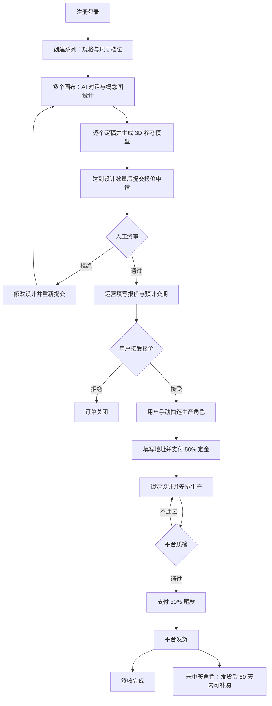
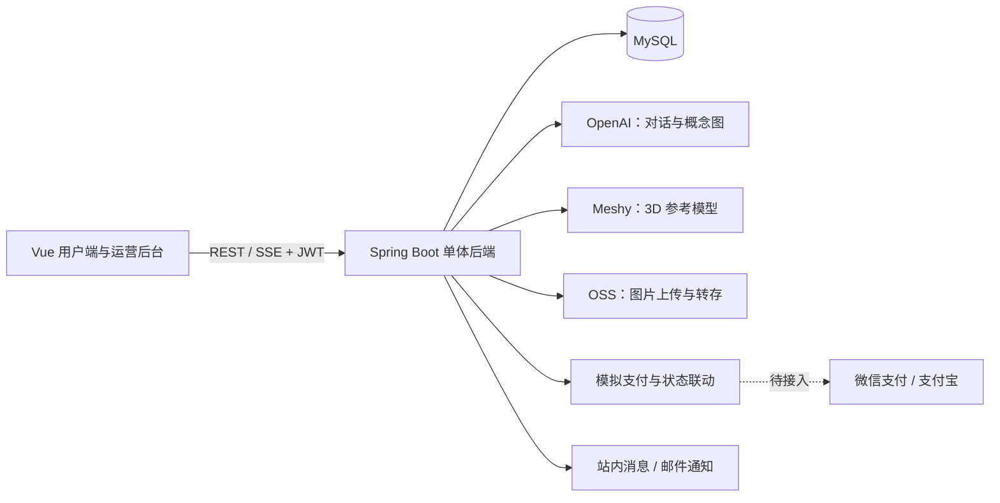

# DIY Figure · AI 定制盲盒手办平台

**从一个原创角色想法，到一套由自己参与设计的实体盲盒。**

DIY Figure 面向原创角色收藏、个性化礼物与定制手办场景，将 AI 对话设计、系列管理、人工终审、报价抽选、分期付款与生产履约组织在同一套系统中。用户表达创意并确认设计，平台运营负责审核、报价、厂家对接、质检与发货。

> **当前状态：内部 Alpha。软件侧可开发内容已收口并推送到 `main`；尚未进入真实付费与真实履约。**
>
> 用户端与运营后台的模拟闭环（设计 → 终审 → 报价 → 抽选 → 地址 → 定金 → 生产 → 质检 → 尾款 → 发货 → 签收 → 补购）已有代码、测试和本地跑通记录。支付仍是模拟；真实 AI / 3D / OSS / 邮件依赖外部密钥；供应链参数空白。当前版本**不适合开放真实付费业务**。
>
> 状态核对日期：**2026-09-14**（已提交并推送，HEAD `a26d9da`）。本文区分“已有代码”“部分或模拟实现”“尚未开发”和“尚未验证”，不把接口存在视为产品验收通过。

[产品与流程](#产品与流程) · [功能完成情况](#功能完成情况) · [当前阶段与验证](#当前阶段与验证) · [已知问题](#已知问题) · [架构与目录](#架构与目录) · [本地开发](#本地开发) · [后续路线图](#后续路线图) · [参与贡献](#参与贡献)

## 产品与流程

### 为什么做

让用户参与整套原创角色的设计，并将设计与实体交付连接起来。项目的价值目标包括：

- **创作参与感**：通过文字与参考图片逐步完善自己的角色形象。
- **系列化收藏体验**：将多个角色组织成一个系列，通过抽选决定实际生产的角色组合。
- **可追踪的定制流程**：连接终审、报价、付款、生产、质检、发货与补购。
- **人工交付把关**：保留人工终审和质检，AI 生成的 3D 结果作为厂家精修参考。

项目按小规模、人工运营的定制业务设计。原规划中的月订单量属于容量假设，不代表已有实际订单或营业成绩。商业可行性仍需通过样品、成本核算和真实用户交付验证。

### 用户与职责

| 角色 | 职责 |
| --- | --- |
| 普通用户 | 创建系列、与 AI 协作设计、定稿、接受报价、抽选、填写地址、付款、签收和补购 |
| 平台运营 | 人工终审、报价与交期、厂家对接、开工登记、质检、发货和取消处理 |
| 合作厂家 | 在线下或站外接收生产材料并制造；V1 没有厂家账号或供应商门户 |

### 目标业务闭环

下图描述产品目标流程，各环节的实际完成情况见后文。



终审拒绝后的返工已闭环：`REVIEW_REJECTED → DRAFT_SUBMIT_PENDING`（`resubmit`）→ 修改画布 → `submit-review` 再次进入终审；拒绝报价后可用 `reopen` 回到草稿再提交。

### 规格与业务规则

| 档位 | 枚举 | 设计角色数 | 实际定制数 | 未中签角色数 |
| --- | --- | ---: | ---: | ---: |
| 轻量系列 | `LIGHT` | 6 | 4 | 2 |
| 经典系列 | `CLASSIC` | 9 | 6 | 3 |
| 收藏系列 | `COLLECTION` | 12 | 8 | 4 |

- **原创设计约束**：项目规则禁止复刻可辨识的明星、公众人物或已有版权 IP 角色。现有实现包括 AI 提示词约束和人工审核入口，审核准确率尚未验证。
- **手动抽选**：接受报价后由用户触发，从设计集合随机选出生产角色。抽奖前 `lottery_result=UNDECIDED`，避免详情页把全部角色显示成中签；重复抽选被状态机拒绝，订单行带 `@Version` 乐观锁。
- **付款节点**：定金与尾款各占报价的 50%；定金成功后锁定设计，质检通过后进入尾款环节，尾款成功后允许发货。
- **实际开工**：进入 `IN_PRODUCTION` 与厂家实际开工分开记录，后者使用 `production_started_at`。
- **补购**：主订单发货后 60 天内可补购未中签角色，价格为 `(套餐总价 ÷ 中签数量) × 1.3`；跳过设计、终审、报价和抽选，复用定金、生产、质检、尾款与发货流程。
- **取消规则目标**：未付定金无损取消；付定金但未开工扣除实付定金 30% 退 70%；已开工定金不退。计算已按支付事实落地并有单测；真实渠道退款仍未接入，取消时会在支付单上记录应退金额。
- **供应链待确认参数**：报价基准、生产周期、实际包装尺寸、厂家接收格式与样品质量标准。

### V1 范围边界

V1 聚焦国内、小规模原创定制订单，不包含国际发货、Stripe 国际支付、用户间转售、二手市场或厂家门户。3D 模型是精修参考，不能直接宣称为可打印、可量产文件。Flux、Tripo3D 等历史候选方案不属于当前已实现集成。

## 功能完成情况

**状态口径：**“初版已实现”表示页面或服务中存在对应代码，不表示已通过联调、安全测试或真实业务验收；“部分实现”表示关键环节仍有缺失；“模拟实现”表示不能处理真实外部业务。

### 用户端与设计能力

| 模块 | 已有实现 | 未完成或待验证 | 状态 |
| --- | --- | --- | --- |
| 账号认证 | 用户名、邮箱、密码注册；用户名或邮箱登录；BCrypt；JWT；个人信息与修改密码；邮箱验证令牌；忘记密码重置 | 第三方登录不进入 V1(需 OAuth 应用凭证)；无 SMTP 时验证邮件只记日志 | 初版已实现 |
| 系列管理 | 创建、列表、详情、重命名（名称+尺寸档位）、删除；规格档位与设计状态；已产生订单的系列禁止删除（删除会连带画布） | 交易期间修改边界需验收 | 初版已实现 |
| 画布管理 | 创建（角色名称）、详情、删除、定稿、重新打开；对话与概念图记录；已锁定或被订单引用的画布禁止删除；重新打开会清空上一版定稿的 3D 模型 | 交易期间修改边界需验收 | 初版已实现 |
| AI 对话 | 文字与参考图 URL 输入；SSE 流式回复；对话记录；原创设计提示词约束 | 真实服务成功率、历史上下文、多模态效果和失败恢复未验收 | 接入代码已有，含模拟分支 |
| 图片输入 | JPEG、PNG、GIF、WebP 上传服务与参考图入口；OSS 未配置时落本地磁盘并返回可访问 URL | PDF、Word 等通用文件解析未实现 | 部分实现 |
| 2D 概念图 | 勾选生成图片；调用图像服务；图片列表预览；尝试转存 OSS | 三视图一致性、结果质量、永久保存与失败恢复未验收 | 接入代码已有，含占位分支 |
| 3D 参考模型 | 定稿时入队、后台调度异步生成；保存模型 URL；three.js 可旋转预览（拖动旋转/滚轮缩放/自动旋转/重置视角）、下载入口、失败重试入口 | 真实 Meshy 产物未验收；非 `.glb` 时降级为下载入口 | 初版已实现 |
| 地址管理 | 地址增删改查、默认地址、主订单地址绑定 | 地址变更与订单交付信息的一致性需验收 | 初版已实现 |
| 用户协议与合规说明 | `/terms` 页面：服务说明、原创性合规红线（AI 自审 + 人工终审双重拦截）、定制商品交易规则、取消违约金三档、补购规则、AI 生成内容免责、责任限制、通知方式、协议变更；未登录可访问，页脚有入口 | 正式主体信息、争议解决与管辖法院、生效日期需法务审阅后补齐 | 初版已实现（草案 v0.1） |

### 交易与运营能力

| 模块 | 已有实现 | 未完成或待验证 | 状态 |
| --- | --- | --- | --- |
| 报价申请 | 系列、画布归属、定稿及数量校验；创建订单与画布关联；同一系列进行中的主订单不可重复提交 | 审核后若改画布，须走返工接口再提交终审 | 初版已实现 |
| 人工终审 | 待审列表、通过或拒绝、拒绝理由、审核日志；服务端 `ADMIN` 角色校验；**终审弹窗内展示全部定稿设计稿缩略图与角色名**（可点击放大），作为侵权风险判断依据 | 拒绝后原订单重提链路已完成；审核留痕的人员维度未记录 | 初版已实现 |
| 人工报价 | 录入价格与预计交期；用户接受或拒绝；接受时校验报价已填写且大于 0；报价弹窗展示系列档位、设计数量、**档位中签数**与设计稿（抽奖前不把角色标成已中签） | 交期为空时是否允许接受，规则待确认 | 初版已实现 |
| 随机抽选 | 按档位抽取角色；抽奖前为 `UNDECIDED`；保存中签和未中签；重复抽选拒绝 | 双请求并发抽奖依赖乐观锁，未做独立压测 | 初版已实现 |
| 定金与尾款 | 支付单、支付记录、模拟成功、订单状态联动与画布锁定；模拟入口有环境隔离与归属校验；回调路径在 JWT 白名单内，HMAC 验签失败关闭，金额必须与支付单一致，重复回调幂等 | 微信/支付宝官方 SDK、商户号、对账与真实退款打款未接入 | 模拟实现 |
| 生产管理 | 开工记录、生产列表、提交质检；**每单可查看历史质检记录**（结论、时间、不通过原因） | 厂家站外对接；系统状态不证明实际生产完成 | 初版已实现 |
| 质检 | 通过、失败原因、质检日志；失败返工、通过进入尾款 | 样品质检标准与实际执行待验证 | 初版已实现 |
| 发货与签收 | 物流公司与单号录入、发货状态、用户签收、运营标记完成 | 物流轨迹查询未集成；实际交付未验证 | 初版已实现 |
| 取消与费用 | 取消状态、扣款和应退金额计算、取消记录；按真实支付事实分三档 | 比例固定为 30%；真实退款未实现 | 部分实现 |
| 重新提交 | 终审拒绝后重新提交（`REVIEW_REJECTED → DRAFT_SUBMIT_PENDING`）；拒绝报价后重开（`CLOSED → DRAFT_SUBMIT_PENDING`）；详情返回拒绝理由 | 修改画布与重新提交的联动提示待完善 | 初版已实现 |
| 管理员初始化 | 通过 `ADMIN_INIT_*` 环境变量受控创建首个运营账号，默认关闭 | 生产环境需要有意识地轮换初始密码 | 初版已实现 |
| 补购 | 未中签列表、窗口检查、价格计算、防重复检查、补购订单与支付入口 | 并发去重、过期边界和完整履约链路未验收 | 初版已实现 |
| 补购到期扫描 | 每日 02:00 扫描并记录过期数量 | 扫描不修改状态；禁止过期补购由服务中的日期检查负责 | 初版已实现 |
| 运营看板 | 待审、报价、生产、质检、发货等状态统计与页面；`/**/admin/**` 要求 `ADMIN` | 真实运营负载与交互未验收 | 初版已实现 |
| 站内消息 | `Notification` 实体、枚举、Repository；订单状态机每次转移都写入站内消息（覆盖 14 个状态节点）；列表、未读数、单条已读（含归属校验，不能替别人点已读）、全部已读 4 个接口；导航栏铃铛角标（未读 > 0 才显示）+ 消息中心页面 `/notifications` | 消息保留策略与清理未定义 | 初版已实现 |
| 邮件通知 | `EmailService` 覆盖报价确认、需付尾款、已发货三个节点的邮件发送；注册为**事务提交后回调**，避免「事务回滚但邮件已发出」；未配置 SMTP 时自动降级为站内消息，不抛异常、不阻塞主流程 | 生产 SMTP 参数需你提供；真实投递未验收 | 接入代码已有，缺配置 |

### 工程与交付能力

| 能力 | 当前情况 |
| --- | --- |
| 数据层 | JPA 实体 13 个（含 `AuthToken`）；Flyway V1–V6（V6：邮箱验证、退款记账、抽奖 `UNDECIDED`、默认地址）；生产 profile `ddl-auto=validate`；开发库首次启用时自动基线 |
| 后端公共能力 | 统一响应、异常处理、参数校验、JWT 拦截器、管理员角色拦截器、健康检查（含数据库）、订单状态日志、站内消息与邮件通知 |
| 自动化测试 | 后端 87 个用例（55 集成 + 32 单元）+ 前端 Vitest 9 个用例（金额格式化 + SSE 解析）；GitHub Actions CI 都跑 |
| 构建验证 | 后端编译与测试通过；前端 Vitest 9/9 + 生产构建通过（约 4s，仅剩 chunk 体积告警） |
| 部署交付 | 多阶段 `Dockerfile`、`docker-compose.yml`、`.env.example`、`application-prod.yml`、GitHub Actions CI、`deploy/nginx.conf`（含 SSE 关缓冲）、`deploy/ops.md`（备份/回滚说明）。真实环境回滚演练尚未做过 |
| 开源协作 | 已有 `CONTRIBUTING.md`、`SECURITY.md`、`CHANGELOG.md`、根 `.gitignore`。仓库仍无 `LICENSE`，协议需维护者选择 |

## 当前阶段与验证

### 阶段判断

**INFERENCE（基于代码与验证的判断）：核心功能初版已成形，处于阶段 2 的开发与联调收敛期，尚未达到阶段 3 的小范围真实用户验证上线。**

| 原项目阶段 | 当前判断 | 判定依据 |
| --- | --- | --- |
| 阶段 0：需求与商业模式确认 | 基础文档已形成 | 有规划、需求和技术设计；商业假设仍需真实交付验证 |
| 阶段 1：供应链对接 | 仓库中未证明完成 | 厂家报价、周期、尺寸与交付格式仍待回填；线下进展未知 |
| 阶段 2：技术架构与开发 | **当前阶段（2A 软件收口，卡在 2B 真实集成）** | 模拟闭环、权限、测试、构建、容器与文档已齐；真实 AI/支付/OSS 未联调 |
| 阶段 3：小范围验证上线 | 尚未证明进入 | 没有完整真实订单交付与用户验证证据 |
| 阶段 4：正式运营与迭代 | 尚未证明进入 | 需在小范围交付、成本与质量验证之后推进 |

不使用单一百分比衡量完成度：功能代码覆盖、工程可靠性、真实集成和供应链履约是不同维度，不能互相替代。

### 已执行验证

**FACT（已验证事实）：**以下为 2026-09-14、已推送提交 HEAD `a26d9da` 的本地检查结果，不是持续集成徽章或发布认证。

| 检查 | 结果 | 能证明什么 |
| --- | --- | --- |
| `mvn -o -DskipTests compile` | **通过**，编译 111 个 Java 源文件 | 本地依赖条件下后端可编译；未执行测试 |
| `mvn test` | **通过**，87 个用例（55 集成 + 32 单元） | 主订单全链路、支付回调验签、邮箱验证/重置密码有回归保护；不等于完整测试覆盖 |
| 集成测试（独立库 `diy_figure_it`，`ddl-auto=validate`） | **通过** | Flyway 脚本与 JPA 实体一致；主订单、返工、取消三档、补购、过期、关闭重开、质检返工、支付幂等分支均可重复通过 |
| 跨用户/角色越权（service 层 + MockMvc 走 controller） | **通过** | 画布/系列/订单/支付/地址/补购均校验 userId 归属；USER 访问 admin 端点被 AdminInterceptor 挡 403；未登录被 JwtInterceptor 挡 401 |
| `npm run test`（前端 Vitest） | **通过**，9 个用例 | 金额格式化 + SSE 解析 |
| 浏览器端到端（agent-browser + 真实 Chromium） | **通过** | 用户端：登录、订单列表、详情（含抽奖结果 4 中签 / 2 未中签）、通知中心、全部标为已读、**用户协议与合规说明页（页脚入口点击跳转 → `/terms`，未登录可访问，9 个章节与目录锚点正常）**。运营端：控制台看板（9 个统计与 API 完全对得上）、待终审、待报价、生产物流管理（5 个标签页，3 单生产中）。脚本在 `/tmp/diy_e2e_seed.py` + `/tmp/diy_e2e_step.py` |
| 空库 + `prod` profile 启动（Flyway + `ddl-auto=validate`） | **通过** | V1 脚本建表成功且实体映射校验通过；开发库自动基线，既有 11 条订单数据未受影响 |
| `npm run build` | **通过**（3.91s） | 前端可产出生产包；仍有 chunk 体积告警（`index` 1.25 MB / `three.module` 671 kB，均为 gzip 前） |
| 后端测试与前端构建复跑 | **通过**（2026-09-14 复跑） | `mvn -o test` 87/87 绿、`npm run test` 9/9 绿、`npm run build` 通过 |
| 业务代码与文档核对 | 已完成本次静态检查 | 发现下述缺口；不等于完整安全审计 |
| OpenAI、Meshy、OSS、支付真实调用 | 本次未执行 | 不能宣称真实集成已通过 |

**UNKNOWN（仍待验证）：**线上部署、历史真实 AI 调用、厂家线下进展、样品质量、真实订单、复购及盈利情况。仓库未提供证据不等于这些工作在线下从未发生。

## 已知问题

以下问题应在开放真实用户业务前处理，清单不代表穷尽所有缺陷。

| 优先级 | 问题与影响 | 代码入口 | 状态 |
| --- | --- | --- | --- |
| ~~阻塞构建~~ | `Dashboard` 图标导入不存在，前端不能完成生产打包 | [AdminLayout.vue](frontend/src/layouts/AdminLayout.vue) | **已修复**（2026-09-13 构建通过） |
| ~~阻塞试用~~ | 终审、报价、生产等运营接口缺少服务端管理员角色校验 | [AdminInterceptor](backend/src/main/java/com/diyfigure/auth/AdminInterceptor.java)（新增）、[WebMvcConfig](backend/src/main/java/com/diyfigure/config/WebMvcConfig.java) | **已修复**：`/**/admin/**` 统一要求 `ADMIN` 角色，非管理员返回 403 |
| 阻塞真实交易 | 支付仍为模拟模式；真实下单、官方 SDK 验签、对账、退款打款未完成 | [PaymentService](backend/src/main/java/com/diyfigure/payment/PaymentService.java)、[PaymentController](backend/src/main/java/com/diyfigure/payment/PaymentController.java) | **部分修复**：模拟入口已隔离；回调已进 JWT 白名单并以 HMAC 失败关闭，金额与支付单核对；真实商户 SDK 仍未接入 |
| ~~阻塞交易完整性~~ | 删除系列/画布未阻止删除已被订单引用的数据 | [SeriesService](backend/src/main/java/com/diyfigure/series/SeriesService.java)、[CanvasService](backend/src/main/java/com/diyfigure/canvas/CanvasService.java) | **已修复**：系列存在订单、画布被 `order_canvas` 引用时拒绝删除（409） |
| ~~阻塞交易完整性~~ | 审核通过即进入 `QUOTED`，未填价格也能接受报价 | [OrderService](backend/src/main/java/com/diyfigure/order/service/OrderService.java) | **已修复**：接受报价前校验 `quotedPrice` 存在且大于 0 |
| ~~阻塞金额正确性~~ | `DEPOSIT_PENDING` 未付定金订单会落入"已付未开工"费用分支 | [ProductionService](backend/src/main/java/com/diyfigure/production/ProductionService.java) | **已修复**：按是否存在 `SUCCESS` 定金支付单判定档位；真实退款仍缺失 |
| V1 已定 | 定金成功锁定订单关联的全部画布(含未中签)。未中签角色是已过审的潜在补购品,允许修改会重新触发合规审核 | [PaymentService](backend/src/main/java/com/diyfigure/payment/PaymentService.java) | **V1 采用全部锁定** |
| ~~待补齐~~ | 数据库无版本迁移脚本，首次部署需先手工建表 | [V1__init_schema.sql](backend/src/main/resources/db/migration/V1__init_schema.sql) | **已修复**：接入 Flyway，V1 已通过空库 + `validate` 验证 |
| ~~待可靠性改造~~ | 定稿同步轮询 Meshy（最长阻塞 5 分钟），会撑爆前端 30 秒超时 | [CanvasService](backend/src/main/java/com/diyfigure/canvas/CanvasService.java)、[Model3dTaskService](backend/src/main/java/com/diyfigure/integration/ai/Model3dTaskService.java) | **已修复**：定稿只入队立即返回（实测 0.10s），后台每 15s 推进，失败可手动重试；前端按状态显示生成中/失败可重试，非 .glb 链接降级为下载 |
| ~~待一致性验证~~ | 抽选、支付单、补购去重依赖应用层检查，无实体版本锁 | [order](backend/src/main/java/com/diyfigure/order)、[payment](backend/src/main/java/com/diyfigure/payment)、[refill](backend/src/main/java/com/diyfigure/refill) | **已修复**：`order`/`order_canvas`/`payment`/`canvas`/`series` 均已加 `@Version` 乐观锁 |
| ~~阻塞返工闭环~~ | 终审拒绝后"重新提交"只回到草稿态，没有任何接口能再次进入终审，订单永久卡死 | [OrderService](backend/src/main/java/com/diyfigure/order/service/OrderService.java) | **已修复**：新增 `POST /api/orders/{id}/submit-review`，提交时重新校验画布数量与定稿状态 |
| ~~阻塞生产启动~~ | V3 迁移把 `model_3d_status` 建成了 `varchar`，与 Hibernate 期望的 `enum` 不一致，生产 `ddl-auto=validate` 会直接启动失败 | [V3](backend/src/main/resources/db/migration/V3__add_model3d_task.sql)、[V4](backend/src/main/resources/db/migration/V4__fix_model3d_status_type.sql) | **已修复**：V3 改为直接建 enum，V4 纠正已迁移的库（由集成测试的 `validate` 暴露） |

生产部署必须使用 `SPRING_PROFILES_ACTIVE=prod`：`ddl-auto=validate`、JWT 与 CORS 由环境变量注入、模拟支付强制关闭。不要用开发默认密钥上线。真实环境的备份恢复演练尚未做过，步骤见 [deploy/ops.md](deploy/ops.md)。

## 架构与目录

### 当前代码使用的技术栈

| 层次 | 实际实现 |
| --- | --- |
| 前端 | Vue 3、Vue Router、Pinia、Element Plus、Axios、Vite；JavaScript |
| 后端 | Java 17、Spring Boot 3.2.5、Spring Web、Validation、Spring Data JPA |
| 数据库 | MySQL；Hibernate 实体映射 |
| 认证 | 自定义 JWT 拦截器、JJWT 0.12.5；Spring Security Crypto 仅用于 BCrypt，并非完整授权体系 |
| AI 对话与图片 | Java HttpClient 调用 OpenAI；仓库默认模型为 `gpt-4o` 和 `dall-e-3` |
| 3D | Meshy image-to-3D 接入与轮询 |
| 文件存储 | 阿里云 OSS SDK 3.17.4；缺配置时有降级分支 |
| 实时响应 | AI 对话使用 SSE，其他业务使用 REST API |
| 定时任务 | Spring `@Scheduled`；没有消息队列或 Redis 依赖 |

模型名称描述仓库配置，不保证当前服务商可用性或账号权限，真实调用前需要验证。



AI 和 OSS 节点表示已有接入代码，仍可能执行模拟或降级分支。通知节点已完整落地（站内消息随状态机全量产生，邮件在报价确认/需付尾款/已发货三个节点发送，未配 SMTP 时自动降级）。

### 领域模型与状态机

- `Series`：设计系列，保存名称、规格、尺寸与设计状态。
- `Canvas`：单个角色画布，保存对话、概念图、模型 URL、定稿与锁定状态。
- `OrderEntity`：交易订单，`MAIN` 主订单与 `REFILL` 补购共用实体。
- `OrderCanvas`：关联订单与角色，保存抽选结果和补购有效期。
- `Payment`、`Address`：支付记录与收货地址（地址含默认标记；取消时支付单可记应退金额）。
- `AuthToken`：邮箱验证与密码重置令牌（库中只存哈希）。
- `ReviewLog`、`QualityCheckLog`、`CancellationLog`、`OrderStatusLog`：审核、质检、取消和状态变更记录。
- `Notification`：站内消息记录，由状态机旁路产生（`NotificationService` + `EmailService`）。

主订单当前正常路径：

```text
DRAFT_SUBMIT_PENDING → REVIEWING → QUOTED → LOTTERY_PENDING
→ LOTTERY_DONE → DEPOSIT_PENDING → IN_PRODUCTION → QC_PENDING
→ BALANCE_PENDING → SHIPPING_PENDING → SHIPPED → COMPLETED
```

还定义了 `REVIEW_REJECTED`、`CLOSED`、`CANCELLED` 及质检返工分支。补购从 `DEPOSIT_PENDING` 开始。允许转移集中在 [OrderStatus](backend/src/main/java/com/diyfigure/common/enums/OrderStatus.java)，变更与日志由 [OrderStateMachineService](backend/src/main/java/com/diyfigure/order/service/OrderStateMachineService.java) 处理。模拟主链路的 API 与页面已接上；真实支付与真实 AI 产物仍未验收。

### 仓库结构

```text
.
├── README.md                     # 项目入口、实现状态与路线图
├── 01-项目规划书.md / 02-产品需求说明书.md / 03-技术设计说明书.md
├── CONTRIBUTING.md / SECURITY.md / CHANGELOG.md
├── .env.example / .gitignore / docker-compose.yml
├── .github/workflows/ci.yml
├── deploy/nginx.conf             # 反代与 SSE 关缓冲
├── deploy/ops.md                 # 备份、回滚、故障定位
├── backend/
│   ├── Dockerfile
│   ├── pom.xml
│   └── src/
│       ├── main/java/com/diyfigure/
│       │   ├── auth/              # 注册、登录、JWT、邮箱验证、重置密码
│       │   ├── series/ / canvas/ / order/ / payment / production / refill / address
│       │   ├── notification/      # 站内消息与邮件
│       │   ├── integration/       # OpenAI、Meshy、OSS、本地降级存储
│       │   ├── entity/ / repository/ / common/ / config/
│       ├── main/resources/        # application.yml、prod、Flyway V1–V6
│       └── test/                  # 集成 + 单元（独立库 diy_figure_it）
└── frontend/
    ├── package.json / vite.config.js / vitest.config.js
    └── src/
        ├── api/ / router/ / stores/ / layouts/ / components/ / utils/
        └── views/                # 20 个页面（含协议、通知、验证邮箱、重置密码、运营后台）
```

### 文档与代码的差异

历史文档保留设计背景，不能直接当作实现证明：

| 历史描述 | 当前代码 |
| --- | --- |
| 通义千问 / 智谱与通义万相候选 | OpenAI 对话与图片服务 |
| Spring Security + JWT | 自定义 JWT 拦截器 + BCrypt 工具库 |
| 独立 review、quote、lottery、cancellation、notification 模块 | 前三者在 order，取消在 production，通知在 notification（`NotificationService` / `EmailService` / `NotificationController` 已完整实现） |
| 图片、文件输入与可旋转 3D 预览 | 文字和参考图片输入；3D 已实现可旋转预览（three.js，拖动旋转/滚轮缩放/自动旋转/重置视角）+ 下载链接 |
| 微信与支付宝官方 SDK | 模拟支付 + HMAC 回调适配器；官方 SDK 未接入 |

本文更新 README，不自动更改历史设计决定；后续实现或调整需求时应同步相关文档。

## 本地开发

以下命令用于准备本地环境，**不是“一键启动已验收真实业务”承诺**。2026-09-14 已在本机用 JDK 17、Maven 3.9.6、Node 22、MySQL 8 把前后端拉起来，健康检查与登录可用。macOS 若配了代理，访问本机必须加 `curl --noproxy '*'`。

### 环境要求

| 依赖 | 要求或说明 |
| --- | --- |
| JDK | 17，来自后端编译配置 |
| Maven | 3.x；本次编译使用 Maven 3.9.6；仓库没有 Maven Wrapper |
| Node.js / npm | 本次前端检查使用 Node.js 22 系列；未声明 engines 或完整兼容矩阵 |
| MySQL | 建议本地 MySQL 8.x 独立开发库；最低兼容版本未验证 |
| 外部服务 | 默认占位配置可走部分演示分支；真实 AI、存储与 3D 需要各自账号和密钥 |

### 1. 准备数据库与后端配置

在本地 MySQL 创建独立开发数据库，并为开发账号授予该库所需权限：

```sql
CREATE DATABASE diy_figure CHARACTER SET utf8mb4 COLLATE utf8mb4_unicode_ci;
```

默认连接 `localhost:3306/diy_figure`。在启动后端的终端配置环境变量，替换下面的示例值：

```bash
export DB_USERNAME='your_local_db_user'
export DB_PASSWORD='your_local_db_password'
export JWT_SECRET='replace-with-a-random-secret-of-at-least-32-bytes'
```

`JWT_SECRET` 通过 Spring Boot 环境属性覆盖 `jwt.secret`。其他数据库地址可通过 `SPRING_DATASOURCE_URL` 覆盖。项目没有自动加载根目录 `.env` 的机制（Docker Compose 会读 `.env`），本地请用终端环境变量或 IDE 配置，不要提交真实凭据。

开发 profile 使用 Flyway + `ddl-auto=update`，并对已有库 `baseline-on-migrate`。生产必须用 `prod` profile 的 `ddl-auto=validate`，表结构只认 `db/migration`。后续变更请新增 `V7__xxx.sql`，不要改已执行过的版本文件。

另外需要独立测试库，**不要把集成测试指到开发库**（测试会 `flyway.clean()`）：

```sql
CREATE DATABASE diy_figure_it DEFAULT CHARACTER SET utf8mb4;
```

### 2. 编译并启动后端

从仓库根目录执行：

```bash
cd backend
mvn -DskipTests compile
mvn spring-boot:run
```

后端默认地址为 `http://localhost:8080/api`。在另一个终端检查：

```bash
curl --noproxy '*' http://localhost:8080/api/health
```

成功时返回包含 `code: 200`、`data.status: "UP"`，以及 `data.database: "UP"` 的 JSON。该接口说明进程和数据库可连，不证明 AI、支付或履约链路健康。

本仓库开发时 8080 常被占用，实际常用 **8088**：后端 `SERVER_PORT=8088 mvn -o spring-boot:run`，前端 `VITE_BACKEND_TARGET=http://localhost:8088 npm run dev`。

### 3. 安装并启动前端

在仓库根目录另开一个终端：

```bash
cd frontend
npm ci
npm run dev
```

默认访问 `http://localhost:5173`。Vite 将 `/api` 代理到 `http://localhost:8080`；Axios 默认请求超时 30 秒。

若 8080 端口被占用，不必改动配置文件：后端用 `SERVER_PORT=8088 mvn spring-boot:run` 启动，前端用 `VITE_BACKEND_TARGET=http://localhost:8088 npm run dev` 指定代理目标即可。

| 入口 | 用途 |
| --- | --- |
| `/login` | 注册与登录、忘记密码 |
| `/verify-email` `/reset-password` | 邮箱验证、密码重置（公开页） |
| `/terms` | 用户协议与合规说明（未登录可访问） |
| `/series` | 系列列表 |
| `/canvases/:id` | AI 设计工作台 |
| `/orders` `/orders/:id` | 订单列表 / 详情（抽奖、地址、报价接受都在详情页） |
| `/payment/:orderId` | 定金与尾款模拟支付 |
| `/refill/:orderId` | 补购 |
| `/notifications` | 站内消息 |
| `/profile` | 个人中心与地址 |
| `/admin` | 运营后台（看板 / 终审 / 报价 / 生产质检） |

注册默认创建 `USER`。**不要**用开放注册提权。需要运营账号时临时开启初始化，创建成功后立刻关掉并重启，然后重新登录（JWT 里带着签发时的角色）：

```bash
ADMIN_INIT_ENABLED=true \
ADMIN_INIT_USERNAME=admin \
ADMIN_INIT_PASSWORD='你的密码' \
ADMIN_INIT_EMAIL=admin@example.com \
mvn -o spring-boot:run
```

### 4. 外部服务与演示模式

| 配置 | 用途 | 缺少真实配置时的当前行为 |
| --- | --- | --- |
| `OPENAI_API_KEY` | 对话与概念图 | 空串、过短或占位密钥走模拟回复 / 占位图片 |
| `MESHY_API_KEY` | 3D 生成 | 空串、过短或占位密钥返回占位任务，并非真实 `.glb` |
| `OSS_ACCESS_KEY_ID` / `OSS_ACCESS_KEY_SECRET` | 上传文件 | 未配置则跳过客户端初始化，参考图落本地磁盘并返回可访问 URL |
| `OSS_BUCKET_NAME` | OSS Bucket | 默认 `diy-figure`，须与自己的资源配置一致 |
| `OSS_ENDPOINT` / `OSS_DOMAIN` | 存储区域与域名 | 可通过 Spring Boot 属性覆盖；默认使用香港区域配置 |
| `DIY_LOCAL_STORAGE_DIR` | 本地降级存储目录 | 默认 `backend/data/uploads`，已加入 `.gitignore` |
| `DIY_PUBLIC_BASE_URL` | 本地降级存储的 URL 前缀 | 留空 = 按当前请求推导（推荐，不会出现端口漂移）；只在反向代理后需要显式配置，且必须含 context-path |
| `DIY_SCHEDULING_ENABLED` | 定时任务总开关 | 默认 `true`；集成测试必须置 `false`。不要写成 `spring.task.scheduling.enabled`，那不是真实 Spring Boot 属性 |
| `DIY_APP_PUBLIC_URL` | 验证邮件 / 重置邮件里的前端地址 | 默认 `http://localhost:5173` |
| `WECHAT_PAY_API_KEY` / `ALIPAY_PAY_API_KEY` | 回调 HMAC | 未配置时回调失败关闭，不会入账 |
| 支付渠道 | 定金与尾款 | 开发/测试可模拟；`prod` 强制关闭模拟支付 |

空串、过短值和 `your-` / `placeholder` 类占位密钥会走降级。OSS 转存失败时，生成图片可能仍保留外部原始 URL。本地磁盘 URL 是本机可访问而非公网可访问，GPT-4o 拉不到本机图片。演示模式不等于完全离线。

只有在准备执行真实联调时才配置真实凭据。真实调用会发送设计文字或参考图并可能产生费用；模拟结果不能作为生成质量或存储成功的证据。

### 5. 构建与测试

后端（在 `backend/`）：

```bash
# 集成测试需要独立的空 schema,先建一次即可
mysql -uroot -p -e "CREATE DATABASE IF NOT EXISTS diy_figure_it DEFAULT CHARACTER SET utf8mb4;"

mvn -DskipTests compile
mvn test -DTEST_DB_PASSWORD=你的数据库密码   # 87 个用例:55 集成 + 32 单元
mvn -DskipTests package
```

`mvn test` 会用 `test` profile 连独立库 `diy_figure_it`，每个用例前由 Flyway `clean + migrate` 重建表，
不会碰到开发库 `diy_figure`。该 profile 用 `ddl-auto=validate`：只要迁移脚本建出来的表和 JPA 实体对不上，
测试就启动失败 —— 所以 `mvn test` 同时是"数据库脚本与代码是否一致"的守卫。
连接信息可用 `TEST_DB_HOST` / `TEST_DB_PORT` / `TEST_DB_NAME` / `TEST_DB_USER` / `TEST_DB_PASSWORD` 覆盖，
CI 里就靠这几个变量指向 GitHub Actions 的 MySQL service。

跳过测试得到 JAR 不等于验收通过。

前端（在 `frontend/`）：

```bash
npm run test     # Vitest 单元测试
npm run build
npm run preview
```

当前构建可通过（`npm run test` 9/9，`npm run build` 约 4s）。仍未启用 ESLint。生产环境用 [deploy/nginx.conf](deploy/nginx.conf) 做静态托管、SPA 回退、`/api` 反代；**SSE 对话必须单独 location 并 `proxy_buffering off`**，否则流式会变成一次性返回。产物里 `index` 与 `three.module` 两个 chunk 超过 500 kB（gzip 前）。

## 后续路线图

保留原阶段 0–4 的定义。下面将当前阶段 2 拆成三个可验收工作包，顺序体现依赖关系，不代表已承诺交付日期。

### 阶段 2A：收敛内部 MVP（软件侧已勾完）

目标：让现有功能成为可以重复演示、验证的内部版本。

- [x] 修复前端构建，确认干净安装后前后端可构建。（2026-09-13 已通过）
- [x] 补齐服务端管理员授权（2026-09-13：`AdminInterceptor` 覆盖 `/**/admin/**`）。剩余：资源归属检查与受控的管理员初始化。
- [x] 隔离模拟支付入口，防止非授权调用改变订单状态。（2026-09-13：环境开关 + 归属校验）
- [x] 修复报价前置条件、未付款取消费用、金额舍入与关联删除保护。（2026-09-13 全部完成，含单元测试）
- [x] 明确定稿、审核、锁定、补购规则，补齐拒绝后重提流程。V1 定金成功后中签与未中签画布全部锁定。
- [x] 为金额计算、状态机规则与取消违约金建立必要测试（当前单元 32、集成 55）。
- [x] 用隔离数据库跑通主订单、返工、取消、补购与过期分支；2026-09-14 含画布生命周期、文件上传降级、邮箱验证、支付回调验签。
- [x] 补并发一致性保护：五张核心表加 `@Version` 乐观锁。
- [x] 接入 CI：GitHub Actions 跑后端测试与前端构建。
- [x] 浏览器端到端验证（2026-09-13：agent-browser + 真实 Chromium，覆盖登录、订单列表、详情、抽奖结果、通知中心、全部标已读）

**退出标准：**前后端构建通过；普通用户无法执行运营操作或修改他人数据；完整模拟订单和关键异常分支可重复通过；保存可复现的测试步骤与结果。

### 阶段 2B：真实集成与需求补齐

- [ ] 验证真实对话、图片生成、参考图上传、图片持久化与真实 3D 产物。
- [x] 将 3D 长任务从同步请求中拆出，提供任务状态、失败提示和受控重试。（2026-09-13：`Model3dTaskService` 每 15s 推进，`POST /canvases/{id}/model3d/retry`）
- [x] 实现 3D 旋转预览（three.js + OrbitControls，非 .glb 链接降级为下载）；明确通用文件输入是补齐实现还是调整 V1 范围。
- [x] 实现站内消息、已读管理与三个关键节点的邮件通知。（2026-09-13：状态机旁路触发，未配 SMTP 时降级为只记日志）
- [x] 实现邮箱验证与忘记密码；第三方登录不进入 V1(需要 OAuth 应用凭证)。
- [ ] 接入微信、支付宝真实下单与验签，补齐金额校验、幂等、对账和退款。回调入口已白名单+HMAC 失败关闭,真实 SDK 仍缺商户号。

**退出标准：**真实产物与永久资源可检查；支付事实与订单状态一致；失败和重试不造成重复扣款或履约；既定 V1 功能已验收，范围调整有明确记录。

### 阶段 2C：部署与发布准备

- [x] 独立生产配置与密钥管理：`application-prod.yml`（`ddl-auto=validate`、密钥由环境变量注入、CORS 白名单、模拟支付强制关闭）。
- [x] 容器化：`backend/Dockerfile`（多阶段、非 root 运行）、根目录 `docker-compose.yml`（MySQL + 后端、健康检查）、`.env.example`。
- [x] 数据库迁移脚本：Flyway V1–V6，空库 + `ddl-auto=validate` 由集成测试守着。备份命令见 `deploy/ops.md`；真实环境演练尚未做过。
- [x] 反向代理与 SSE 配置说明、构建检查、故障定位和发布回滚演练。(见 `deploy/nginx.conf`、`deploy/ops.md`)
- [x] 补齐贡献、安全报告流程与版本变更记录(`CONTRIBUTING.md` / `SECURITY.md` / `CHANGELOG.md`)。许可证协议需业务方选择后添加 `LICENSE`。
- [x] 同步需求和技术文档，使其与最终实现一致。（2026-09-14：修正 README 中「站内消息/邮件通知未实现」等 6 处与代码矛盾的陈旧断言，补齐 `03` 文档 §7.3 接口与 §8 定时任务描述，`02` 文档页面清单补 2 个已实现页面）

**退出标准：**从新环境可重复部署；关键测试通过；配置不依赖开发默认值；回滚与恢复有验证结果；发布包具有明确版本和使用许可。

#### 用 Docker 起一套环境

```bash
cp .env.example .env        # 至少填写 JWT_SECRET
docker compose up -d --build
curl http://localhost:8080/api/health
```

首次部署需要运营账号时，在 `backend` 服务临时增加 `ADMIN_INIT_ENABLED=true`、`ADMIN_INIT_PASSWORD=...`，账号创建成功后移除并重启。

表结构由 Flyway 维护：空库首次启动会执行迁移脚本，已存在的库会自动打基线（不会重复执行 V1，也不会动既有数据）。后续变更请新增 `V7__xxx.sql`，不要修改已执行过的版本文件。

### 阶段 1：供应链对接（可与阶段 2 并行）

- [ ] 确认合作厂家、单件与批量报价、起订量、周期及返工责任。
- [ ] 确认尺寸、材质、包装和厂家接受的 2D/3D 交付格式。
- [ ] 完成样品制造与质检，验证 AI 参考设计到实物的可实现性。
- [ ] 核算 AI、精修、制造、包装、两段物流与售后的完整成本。

**退出标准：**具有可执行报价与交期、合格样品、交付标准和成本依据。未完成时，不能仅凭软件完成度进入真实销售。

### 阶段 3：小范围真实用户验证

前置条件：内部 MVP、必要真实集成、部署准备与供应链样品验证完成。

- [ ] 邀请小规模真实用户走完设计、报价、抽选、付款、生产、质检、发货与签收。
- [ ] 记录实际生成成本、人工耗时、生产周期、返工退款与交付满意度。
- [ ] 验证用户是否愿意支付完整价格，并跟踪补购、复购意愿或行为。

**退出标准：**真实订单可追溯完成交付，质量和成本处于事先确定的可接受范围；观察结果支持继续运营，而非只完成一次演示。

### 阶段 4：正式运营与迭代

根据小范围交付证据调整定价、设计体验、审核与履约效率。国际支付、国际发货及更多生成供应商作为后续候选，不纳入当前 MVP 完成度。

## 参与贡献

当前优先方向是阶段 2B 的真实外部集成、阶段 1 供应链参数，以及 [已知问题](#已知问题) 里仍阻塞真实交易的项。建议先读需求与相关代码，再提交范围明确、可验证的变更。

提交问题时请提供代码版本、环境、复现步骤、预期和实际结果及脱敏日志。涉及权限或真实交易的漏洞细节见 [SECURITY.md](SECURITY.md)。贡献方式见 [CONTRIBUTING.md](CONTRIBUTING.md)。

提交变更时说明解决的问题、行为变化和实际验证；未执行的检查应明确列出。业务规则变化需要同步需求，功能完成后更新本 README 的状态表。请勿提交密钥、个人地址、真实支付信息或数据库数据。

## 文档导航

| 文档 | 阅读目的 |
| --- | --- |
| [项目规划书](01-项目规划书.md) | 定位、商业假设、供应链风险与原阶段规划 |
| [产品需求说明书](02-产品需求说明书.md) | 角色、目标功能、业务规则与状态机 |
| [技术设计说明书](03-技术设计说明书.md) | 历史架构与表设计，结合本文差异表和代码阅读 |
| [贡献指南](CONTRIBUTING.md) / [安全说明](SECURITY.md) / [变更记录](CHANGELOG.md) | 如何改代码、如何报漏洞、版本记录 |
| [Nginx 与运维](deploy/ops.md) / [nginx.conf](deploy/nginx.conf) | 反代、SSE、备份与回滚 |
| [后端依赖](backend/pom.xml) / [前端依赖](frontend/package.json) | 实际依赖与可运行命令 |
| [后端配置](backend/src/main/resources/application.yml) / [生产配置](backend/src/main/resources/application-prod.yml) | 端口、Profile、数据库与外部服务属性 |

## 许可证

当前仓库未包含 `LICENSE`，**尚未声明开源使用许可**。不要将代码可见等同于获得任意复制、分发或商业使用授权。正式开源发布前，需要由维护者选择许可证并加入仓库；本文不代替维护者作出授权决定。
